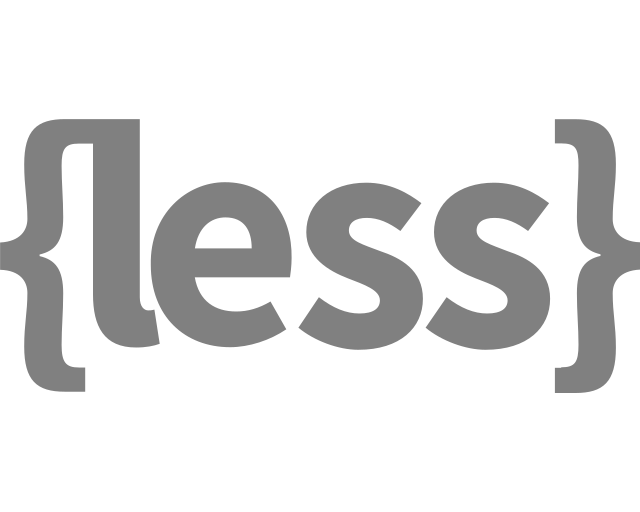
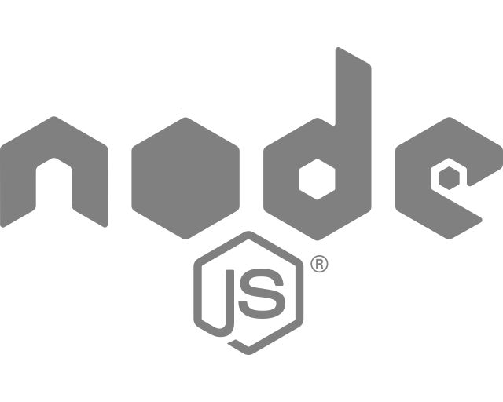

## Hi there 👋

## 🔭 I’m currently working on a React.js app that can play Pexels images and play Spotify at the same time. I'd like to hang a Flat Screen TV on my wall and play live photos. 

 

## 🌱 I’m currently learning Full Stack Development with Lambda School.

## 👯 I’m looking to collaborate on anything to do with Astronomy.

## 🤔 I’m looking for help with creating an Open Source project or Start Up business.

## 💬 Ask me about Astrology or React.js.

## 😄 Pronouns: Him, He.

## ⚡ Fun fact: I can go about 10 wins and 0 loses playing Pool.

## 📫 How to reach me: Eric355402@yahoo.com or 915-534-1154

<!--
**eric-santos/eric-santos** is a ✨ _special_ ✨ repository because its `README.md` (this file) appears on your GitHub profile.
